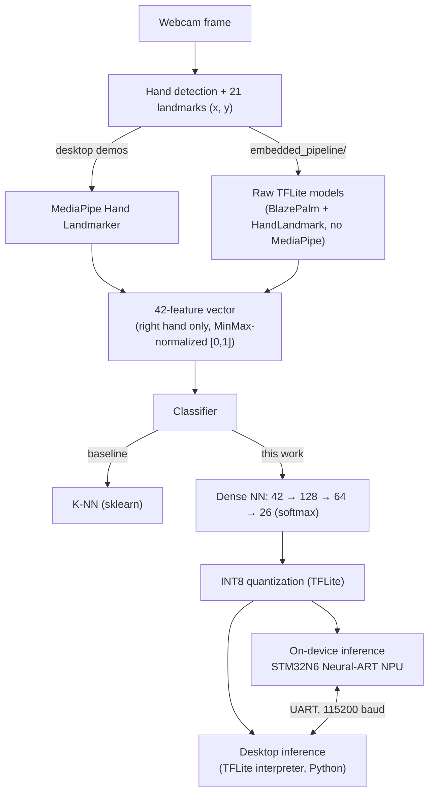

# LIS-Detection

Real-time recognition of the Italian Sign Language (**LIS** – *Lingua Italiana dei Segni*) fingerspelling alphabet: from hand-landmark detection on a webcam frame, to a trained neural-network classifier, to inference running directly on a microcontroller's dedicated NPU.

This is my bachelor's thesis project in Computer Engineering at the Università di Napoli Federico II. It builds on top of [xandrew94x/LIS-Detection](https://github.com/xandrew94x/LIS-Detection) (© Andrea Sciuto, GNU GPLv3), which implements hand detection with MediaPipe + OpenCV and a K-NN classifier for the 26 LIS alphabet letters. On top of that baseline, this project adds:

- a **Dense Neural Network classifier**, trained on a newly acquired dataset, replacing the K-NN baseline;
- an **INT8 quantization pipeline** (Keras → TFLite) to make the model small and fast enough for a microcontroller;
- a **MediaPipe-free hand-landmark pipeline**, reimplemented from the raw BlazePalm / HandLandmark TFLite models, to reproduce on a PC exactly the numerical pipeline that will later run embedded;
- an **STM32CubeIDE project** that deploys the quantized network on an **STM32N6** microcontroller and runs it on its integrated **Neural-ART NPU**, communicating with the host PC over UART.


> 📄 **Full thesis:** [`Tesi_Giulia_Coppola.pdf`](Tesi_Giulia_Coppola.pdf) — the official bachelor's thesis document, with the complete write-up of the background, methodology, implementation and results behind this repository.

## Table of contents

- [Credits & license](#credits--license)
- [How it works](#how-it-works)
- [Repository structure](#repository-structure)
- [System requirements](#system-requirements)
- [Setup](#setup)
- [Usage](#usage)
- [Dataset](#dataset)
- [Model & quantization details](#model--quantization-details)
- [On-device (STM32) status & known limitations](#on-device-stm32-status--known-limitations)
- [Troubleshooting](#troubleshooting)
- [License](#license)

## Credits & license

- **Base project** (hand detection + K-NN classifier): [xandrew94x/LIS-Detection](https://github.com/xandrew94x/LIS-Detection) — © Andrea Sciuto. This repository preserves the full original commit history for attribution; the upstream project remains available as the `upstream` git remote.
- **Extensions** (DNN classifier, quantization, MediaPipe-free pipeline, STM32/NPU deployment): Giulia Coppola, 2025, bachelor thesis work.
- Released under the same **GNU General Public License v3.0** as the original project — see [LICENSE](LICENSE).

## How it works



1. A webcam frame is captured on the PC.
2. MediaPipe (or, in `embedded_pipeline/`, a from-scratch TFLite-only reimplementation of BlazePalm + HandLandmark) locates the hand and extracts 21 landmarks → a 42-value feature vector `(x1, y1, ..., x21, y21)`, normalized to `[0, 1]` with a `MinMaxScaler`.
3. The feature vector is classified into one of the 26 LIS alphabet letters:
   - the **original baseline** uses a K-NN classifier (`py/`, `classifier/knn_model.pkl`);
   - **this thesis** replaces it with a small **Dense Neural Network** (`train_model.py`), trained on a dataset acquired specifically for this work (`handDataset2/`).
4. The trained Keras model is quantized to **INT8 TFLite** (`quant.py`) so it fits and runs efficiently on a microcontroller.
5. The quantized model is deployed with **X-CUBE-AI** onto an **STM32N6 NUCLEO-N657X0-Q** board, which runs it on its Neural-ART NPU. The host PC sends the quantized feature vector over UART and reads back the board's response (see [current status](#on-device-stm32-status--known-limitations) below).

## Repository structure

| Path | Description |
|---|---|
| `py/` | Original baseline demo (MediaPipe + K-NN), from the upstream repo. |
| `classifier/knn_model.pkl` | Original K-NN model. |
| `handDataset2/` | LIS alphabet dataset (26 classes, right hand) acquired for this thesis; used to train the DNN classifier. |
| `train.py`, `train_model.py` | Training of the Dense NN classifier that replaces the K-NN baseline. Saves the trained model, the `LabelEncoder` and the `MinMaxScaler`. |
| `evaluate_classifier.py`, `matrice.py`, `grafico.py` | Evaluation utilities: accuracy, confusion matrix, training-history plots. |
| `quant.py` | Converts the trained Keras model (`.h5`/`.keras`) to INT8 TFLite using representative-dataset calibration. |
| `calib_data.py`, `X_calib.npy` | Builds/stores the calibration dataset used by `quant.py`. |
| `check_dataset.py`, `fix_invalid_vector.py` | Dataset sanity checks and fixes for malformed feature vectors found while building `handDataset2/`. |
| `test.py`, `test_quant.py` | Compare the float Keras model against the quantized TFLite model. |
| `errore h5_tflite.py` | Scratch script documenting/reproducing a `.h5` → TFLite conversion issue encountered during the project. |
| `lis_dnn_model.h5`, `lis_dnn_model_no_dropout.h5` | Saved DNN classifier checkpoints (with/without dropout). |
| `final/` | Earlier iteration of the DNN-based desktop demo, plus the evaluation/comparison scripts used to produce the thesis figures (confusion matrix, accuracy comparison, flow diagram). |
| `final_project/` | **Latest desktop demo app**: webcam capture, MediaPipe landmarks, quantized DNN classifier, and the live UART bridge to the STM32 board. |
| `embedded_pipeline/` | Hand-landmark pipeline reimplemented on the **raw TFLite models** (BlazePalm anchor decoding, NMS, hand-landmark model), with no MediaPipe dependency — used to validate the exact numerical pipeline that runs on the microcontroller. Includes `uart_test.py`, a minimal serial link test. |
| `stm32/progetto_tesi2/` | STM32CubeIDE project for the **NUCLEO-N657X0-Q** board (STM32N6, dual Cortex-M55/M0+, Neural-ART NPU), built with **X-CUBE-AI 10.2.0**. See [below](#on-device-stm32-status--known-limitations) for its structure and current status. |
| `ipynb/` | Notes on classification and data normalization. |

## System requirements

**Hardware**

- A webcam.
- To test on-device inference: an **STM32 NUCLEO-N657X0-Q** board, a USB-C cable (ST-LINK / Virtual COM Port), and [ST-LINK drivers](https://www.st.com/en/development-tools/stsw-link009.html) installed.

**Software — desktop / Python side**

- Python **3.8–3.12** (the original K-NN baseline was developed on 3.8; the DNN/TensorFlow parts also work on newer 3.x).
- Packages listed in [`pip/requirements.txt`](pip/requirements.txt): `opencv-python`, `mediapipe`, `scikit-learn`, `tensorflow`, `matplotlib`, `pyserial`.
- OS: developed and tested on Windows; OpenCV/MediaPipe/TensorFlow are cross-platform, so Linux/macOS should also work (webcam access code may need adjusting).

**Software — embedded side**

- [STM32CubeIDE](https://www.st.com/en/development-tools/stm32cubeide.html) (tested with the version bundling **X-CUBE-AI 10.2.0**).
- The [X-CUBE-AI](https://www.st.com/en/embedded-software/x-cube-ai.html) expansion package (used to import the quantized TFLite model and generate `network.c`/`network.h` for the Neural-ART NPU).
- [STM32CubeProgrammer](https://www.st.com/en/development-tools/stm32cubeprog.html) or STM32CubeIDE's built-in flashing to program the board.

## Setup

1. **Clone the repository:**
   ```
   git clone https://github.com/giuliacoppola/LIS-Detection.git
   cd LIS-Detection
   ```
2. **Create a virtual environment and install the Python dependencies:**
   ```
   python -m venv .venv
   .venv\Scripts\activate      # Windows
   source .venv/bin/activate   # Linux/macOS
   pip install -r pip/requirements.txt
   ```
3. **(Embedded workflow only)** Open `stm32/progetto_tesi2/progetto_tesi2.ioc` in STM32CubeIDE, build the `FSBL` and `Appli` projects, and flash the NUCLEO-N657X0-Q board. Build artifacts (`Debug/`, `.bin`, `.elf`, `.map`, ...) are not versioned — they are regenerated by the IDE.

## Usage

**Baseline desktop demo (K-NN, original repo):**
```
python py/hand_detection_main.py -c classifier/knn_model.pkl
```

**Final desktop demo (Dense NN classifier + live UART bridge to the board):**
```
python final_project/hand_detection_main_final.py -c final_project/lis_dnn_model.keras
```
Update the serial port (`COM3` by default) in `final_project/hand_detection_interface_final.py` to match your board.

**Train the Dense NN classifier on `handDataset2/`:**
```
python train_model.py
```

**Quantize the trained model to INT8 TFLite:**
```
python quant.py
```

**Validate the MediaPipe-free pipeline** (same numerics as the code that will run on the microcontroller, using the raw BlazePalm/HandLandmark TFLite models):
```
python embedded_pipeline/run_pipeline.py
```

**Basic serial link test with the board:**
```
python embedded_pipeline/uart_test.py
```

## Dataset

- **Original K-NN baseline dataset** (26 LIS letters, 500 vectors/class, right hand only): acquired with [acqTool](https://github.com/xandrew94x/acqTool), downloadable [here](https://www.kaggle.com/datasets/andrewk94/handrightdataset).
- **`handDataset2/`** (included in this repo): the dataset acquired for this thesis to train the Dense NN classifier — same 42-feature format `(x1, y1, ..., x21, y21)`, MinMax-normalized to `[0, 1]`, one subfolder per letter (`A/` … `Z/`), each containing pickled `vectors_*.pkl` / `classes_*.pkl` files.

## Model & quantization details

- **Architecture** (`train_model.py`): `Input(42) → Dense(128, relu) → Dropout(0.3) → Dense(64, relu) → Dense(26, softmax)`, trained with Adam, early stopping and checkpointing on validation accuracy.
- **Quantization** (`quant.py`): post-training INT8 quantization of the Keras model to TFLite, calibrated on a representative subset of the training data (`calib_data.py`, `X_calib.npy`). The board expects the classifier's input and output as raw INT8 tensors with the scale/zero-point produced by this step.
- Run `evaluate_classifier.py` / `matrice.py` / `confronto_accuracy.py` (in `final/`) to (re)generate accuracy figures and the confusion matrix for the DNN classifier on your own trained model — these are not committed as static numbers here since they depend on the exact training run.
- The K-NN baseline's confusion matrix is included for reference:

  

## On-device (STM32) status & known limitations

The `stm32/progetto_tesi2` project targets a **NUCLEO-N657X0-Q** (STM32N657, Cortex-M55 + Neural-ART NPU) with a secure-boot layout of two sub-projects:

- **`FSBL/`** — in this project, the first-stage bootloader is also where the UART + NPU inference loop is currently implemented (`FSBL/Core/Src/main.c`), together with the X-CUBE-AI runtime glue (`FSBL/X-CUBE-AI/App/`) and the generated network (`FSBL/X-CUBE-AI/App/network.c/.h`).
- **`Appli/`** — the non-secure application stage generated by CubeMX for the secure/non-secure isolation setup; at the moment it only contains the CubeMX-generated boilerplate (RIF/isolation configuration), with no additional application logic.

**Communication protocol:** the host PC (`final_project/hand_detection_interface_final.py`) quantizes the 42-feature vector to INT8, encodes it as a colon-separated ASCII string (e.g. `12:-34:...:7\n`) and sends it over UART (LPUART1, 115200 baud, via the board's ST-LINK Virtual COM port). The board's interrupt-driven receive routine buffers the string until `\n`, parses it into the NPU's input buffer, and runs inference through ST's `LL_ATON` runtime.

**Current limitation:** at this stage of the project, the firmware's reply over UART echoes back the **parsed input buffer** (for verifying that host → board transmission and parsing are correct), *not yet* the NPU's decoded output/predicted letter — that final step (reading `obuffersInfos`/`buffer_out`, dequantizing, mapping the argmax to a letter, and sending it back) is scaffolded in the code but not wired up yet. Correspondingly, the desktop GUI currently displays the prediction computed **locally** on the PC with the same quantized TFLite model, while independently exercising the UART link to the board as a hardware-in-the-loop check. Finishing the on-device decode-and-reply path is the natural next step for anyone continuing this work.

## Troubleshooting

- **`.h5` → TFLite conversion errors:** see `errore h5_tflite.py` for a reproduction of an issue encountered when converting the Keras model directly from `.h5`; saving/loading via `.keras` format and then quantizing (`quant.py`) avoided it.
- **Malformed feature vectors in the dataset:** `check_dataset.py` scans `handDataset2/` for vectors that don't have exactly 42 features; `fix_invalid_vector.py` was used to repair/discard them.
- **No response / garbled data from the board:** verify the COM port and baud rate (115200) in `final_project/hand_detection_interface_final.py` / `embedded_pipeline/uart_test.py` match your board, and that only one program has the serial port open at a time.

## License

This project is released under the [GNU General Public License v3.0](LICENSE), the same license as the upstream project it builds on.
